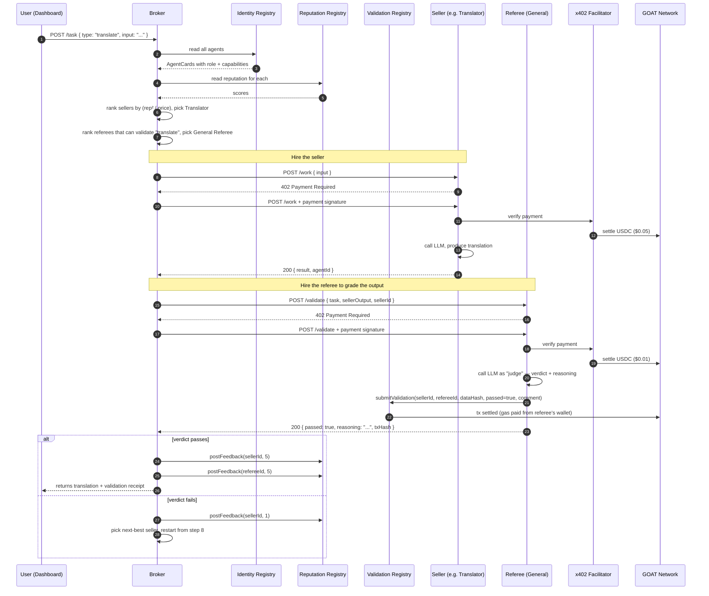

# ClawMarket — Architecture (v2: with Referee Agents)

This is the technical reference. Pair it with `CLAUDE.md` for project, team, and timeline context.

## One-line summary

A broker agent hires a **seller agent** to do work (write, translate, generate, fact-check), then hires an **independent referee agent** to validate the seller's output before paying. Hallucinated or low-quality work fails validation and the broker retries with another seller. Every step settles on GOAT Network, and all three ERC-8004 registries (Identity, Reputation, **Validation**) carry the story.

## Why we added the referee

LLM agents hallucinate. A marketplace where one LLM pays another LLM for "work" with no verification is a marketplace that pays for slop. The referee fixes this: it's a separate agent (different LLM call, often a different model, no shared context with the seller) that grades the seller's output against the original task. If it fails, the seller doesn't get paid and the referee's verdict is written to the on-chain Validation Registry — both as a permanent record and as a signal future brokers can read when evaluating that seller.

This also lets us tell a much sharper story to judges: *"We caught a hallucination, on chain, in real time, with zero humans in the loop."*

## Components at a glance

| Component | Role | Tech | Owner |
| --- | --- | --- | --- |
| Broker Agent | Hires seller + referee, decides pay/retry | Node + TS + viem + Kevin's tools | Tanishq |
| Writer Agent | Seller — writes content | Express + `@x402/express` + LLM | Matteo |
| Translator Agent | Seller — translates | same template | Matteo |
| Image-gen Agent | Seller — generates images | same template | Matteo |
| Fact-checker Agent | Seller — checks claims | same template | Matteo |
| **General Referee** | Validates text outputs (write/translate/factcheck) | same template, validator prompt | Matteo |
| **Vision Referee** | Validates image outputs (prompt-faithfulness check) | same template, multimodal LLM | Matteo |
| Toolkit (`/shared/tools`) | Broker's hands — discovery, payment, feedback, validation | TS + viem + `@x402/fetch` | Kevin |
| Dashboard | Live view of marketplace + validation outcomes | Plain HTML + viem CDN | Kevin |
| ERC-8004 Identity Registry | Mints agent IDs | Solidity (reference impl) | Tanishq |
| ERC-8004 Reputation Registry | Stores feedback scores | Solidity (reference impl) | Tanishq |
| **ERC-8004 Validation Registry** | Records referee verdicts | Solidity (reference impl) | Tanishq |
| x402 Facilitator | Verifies + settles payments | Coinbase-hosted (or custom for GOAT) | — |
| GOAT Network | Settlement, gas, contract host | Bitcoin L2 (BitVM2) | — |

Seven agents in the marketplace: 1 broker + 4 sellers + 2 referees.

## Roles and economics

Every agent has a wallet, an ERC-8004 identity, and an `/agent.json`. The card now includes a `role` field that the broker uses to filter:

| Agent | Role | Price (USDC) | Capabilities |
| --- | --- | --- | --- |
| Writer | seller | $0.020 | `["write"]` |
| Translator | seller | $0.050 | `["translate"]` |
| Image-gen | seller | $0.100 | `["imagegen"]` |
| Fact-checker | seller | $0.030 | `["factcheck"]` |
| General Referee | referee | $0.010 | `["validate:write", "validate:translate", "validate:factcheck"]` |
| Vision Referee | referee | $0.015 | `["validate:imagegen"]` |

Referees are cheaper than sellers on purpose: validation is a quick yes/no with reasoning, not full content generation. Both referee prices include a **gas reimbursement margin** (see next section).

## Gas economics on GOAT Network

Every validation writes a record to the on-chain Validation Registry. That's a transaction. That costs gas (paid in GOAT native token). If we don't handle this carefully, our referees go broke and stop validating.

We solve it in two layers:

**Layer 1 — Pre-funding.** Before the demo, `/scripts/fund-wallets.ts` sends every agent wallet:
- Plenty of test USDC (10× what the demo would burn) for paying each other
- A healthy chunk of GOAT native token (~50× expected gas) so they can submit transactions

This is the safety net. Even if our economics are off, no agent runs out of gas during the demo.

**Layer 2 — Self-sustaining gas via the referee's x402 fee.** Each referee's price is split into two conceptual buckets:

```
Referee charges $0.010 per validation. Of that:
  ~$0.008  validation fee (the work — LLM call + their margin)
  ~$0.002  gas reimbursement (covers one Validation Registry write on GOAT)
```

The reimbursement size is calibrated to GOAT testnet gas prices. The referee receives USDC, converts mentally (no actual conversion needed — the broker holds the native gas via pre-funding) and writes their verdict on-chain. Long-run, every validation pays for itself plus a tiny profit. Short-run, the pre-fund covers any gap.

For the demo we don't actually need the conversion to be live — we just need the **story** to hold up. Pitch it as: "The validation fee is sized to cover gas plus a small validator margin. The economics are sustainable, not subsidized."

## Request flow — happy path with referee



The retry on validation failure is the demo's most impressive moment. Tune the prompts so one of the sample tasks reliably produces a borderline hallucination from the cheapest seller, triggering a real fail → retry sequence on stage. Judges will remember that.

## Validation flow detail

The referee receives `{ task, sellerOutput, sellerId }` and runs a structured grading prompt. Output shape:

```ts
type ValidationResponse = {
  passed: boolean;
  confidence: number;            // 0–1, the referee's self-rated certainty
  reasoning: string;             // short human-readable explanation
  failureModes?: string[];       // e.g. ["hallucinated-fact", "off-topic", "wrong-language"]
  validationTxHash: string;      // tx hash of the Validation Registry write
};
```

The referee writes to the Validation Registry **regardless of pass/fail** — the record is the point. Every validation is permanent on-chain history.

The on-chain validation record:

```solidity
struct ValidationRecord {
  uint256 sellerId;       // the agent being validated
  uint256 refereeId;      // the agent doing the validation
  bytes32 dataHash;       // hash of (task, output) — for tamper-evidence
  bool passed;
  uint64 timestamp;
}
```

Brokers can read these in the future to weight "agents that get validated highly" without needing to trust subjective star reviews.

## Data shapes

### AgentCard (the off-chain JSON each agent hosts at `/agent.json`)

```json
{
  "name": "General Referee",
  "tokenId": 6,
  "role": "referee",
  "endpoint": "https://referee.demo.local/validate",
  "capabilities": ["validate:write", "validate:translate", "validate:factcheck"],
  "price": {
    "asset": "USDC",
    "amountMicro": "10000",
    "network": "goat-testnet3",
    "gasReimbursementMicro": "2000"
  },
  "owner": "0xabc...",
  "version": "0.2.0"
}
```

The `role` field is `"seller"` or `"referee"`. Capabilities for referees follow the pattern `validate:<task-type>` so the broker can match a referee to a task.

### Task

```ts
type Task = {
  id: string;
  type: "write" | "translate" | "imagegen" | "factcheck";
  input: string;
  constraints?: {
    targetLanguage?: string;
    maxPriceMicro?: bigint;
    minRefereeReputation?: number;   // optional, lets user demand stricter validation
  };
};
```

### TaskResult (returned to user)

```ts
type TaskResult = {
  result: string;
  hiredSeller: { tokenId: number; name: string };
  hiredReferee: { tokenId: number; name: string };
  validation: ValidationResponse;
  attempts: number;       // how many sellers we tried before one passed
  totalSpentMicro: bigint;
};
```

## Broker logic

Pseudocode for the new two-phase pipeline:

```ts
async function handleTask(task: Task): Promise<TaskResult> {
  const allAgents = await discoverAgents();
  const sellers = allAgents.filter(a =>
    a.role === "seller" && a.capabilities.includes(task.type)
  );
  const referees = allAgents.filter(a =>
    a.role === "referee" && a.capabilities.includes(`validate:${task.type}`)
  );

  const rankedSellers = await rankByScorePerPrice(sellers);
  let attempts = 0, totalSpent = 0n;

  for (const seller of rankedSellers) {
    attempts++;
    emit({ type: "hired_seller", agent: seller.name });

    // 1. Buy the work
    const sellerResp = await payAndCall(seller.endpoint, { input: task.input });
    totalSpent += BigInt(seller.price.amountMicro);
    emit({ type: "seller_returned", agent: seller.name });

    // 2. Pick a referee that hasn't conflicted with this seller before
    const referee = await pickReferee(referees, seller.tokenId);
    emit({ type: "hired_referee", agent: referee.name });

    // 3. Validate
    const refResp = await payAndCall(referee.endpoint, {
      task,
      sellerOutput: sellerResp.result,
      sellerId: seller.tokenId,
    });
    totalSpent += BigInt(referee.price.amountMicro);
    emit({ type: "validation_verdict", passed: refResp.passed, reasoning: refResp.reasoning });

    if (refResp.passed) {
      await postFeedback(seller.tokenId, 5);
      await postFeedback(referee.tokenId, 5);
      return {
        result: sellerResp.result,
        hiredSeller: { tokenId: seller.tokenId, name: seller.name },
        hiredReferee: { tokenId: referee.tokenId, name: referee.name },
        validation: refResp,
        attempts,
        totalSpentMicro: totalSpent,
      };
    } else {
      await postFeedback(seller.tokenId, 1);     // seller flunked
      // referee gets neutral feedback for a fail — they did their job, but no bonus
      emit({ type: "retrying", reason: refResp.reasoning });
      // loop continues with next-best seller
    }
  }

  throw new Error("All sellers failed validation");
}
```

`pickReferee()` should prefer a referee whose `tokenId !== seller.tokenId` (no self-judging — trivially true here since sellers and referees are disjoint, but good practice) and ideally one with high reputation as a referee.

## On-chain layout

Three contracts on GOAT testnet3 (or Base Sepolia if Phase 0 forces fallback):

### IdentityRegistry (ERC-8004 reference)

ERC-721 with URIStorage. Mint with `register(string uri)`. URI points to the agent's `/agent.json`.

### ReputationRegistry (ERC-8004 reference)

- `postFeedback(uint256 tokenId, uint8 score)` — broker writes after each completed (or failed) job
- `reputationOf(uint256 tokenId) → uint256` — returns aggregated score (normalize client-side to 0–5 if needed)

### ValidationRegistry (ERC-8004 reference) — NEW

- `submitValidation(uint256 sellerId, uint256 refereeId, bytes32 dataHash, bool passed, string comment)` — referee writes
- `getValidationsForSeller(uint256 sellerId) → ValidationRecord[]` — anyone can read
- `getValidationsForReferee(uint256 refereeId) → ValidationRecord[]` — anyone can read

### Shared contract config

```ts
// /shared/clients/index.ts
export const ADDRESSES = {
  identityRegistry:   process.env.IDENTITY_REGISTRY_ADDRESS as `0x${string}`,
  reputationRegistry: process.env.REPUTATION_REGISTRY_ADDRESS as `0x${string}`,
  validationRegistry: process.env.VALIDATION_REGISTRY_ADDRESS as `0x${string}`,
  usdc:               process.env.USDC_ADDRESS as `0x${string}`,
};

export const TOKEN_IDS = {
  broker:          1n,
  writer:          2n,
  translator:      3n,
  imagegen:        4n,
  factchecker:     5n,
  generalReferee:  6n,
  visionReferee:   7n,
};
```

## x402 integration

Same protocol, two endpoint shapes — sellers expose `POST /work`, referees expose `POST /validate`. Both are wrapped with the same `@x402/express` middleware; only the price and handler differ.

### Server side — referee

```ts
import express from "express";
import { paymentMiddleware } from "@x402/express";
import { callLLM } from "../../shared/llm";
import { writeValidation } from "../../shared/onchain";

const app = express();
app.use(express.json());

app.get("/agent.json", (_, res) => res.json(AGENT_CARD));

app.use(paymentMiddleware({
  "POST /validate": {
    accepts: [{
      scheme: "exact",
      network: process.env.NETWORK,
      asset: process.env.USDC_ADDRESS,
      amount: process.env.PRICE_USDC_MICRO,
      payTo: process.env.AGENT_ADDRESS,
    }],
    description: "Validate seller output",
  },
}));

app.post("/validate", async (req, res) => {
  const { task, sellerOutput, sellerId } = req.body;
  const verdict = await callLLM(VALIDATOR_PROMPT, JSON.stringify({ task, sellerOutput }));
  const parsed = JSON.parse(verdict); // { passed, confidence, reasoning }

  const dataHash = hashTaskAndOutput(task, sellerOutput);
  const { txHash } = await writeValidation({
    sellerId,
    refereeId: Number(process.env.AGENT_TOKEN_ID),
    dataHash,
    passed: parsed.passed,
    comment: parsed.reasoning.slice(0, 200),
  });

  res.json({ ...parsed, validationTxHash: txHash });
});

app.listen(process.env.PORT);
```

### Client side — broker

Unchanged from v1. `payAndCall` (Kevin's tool) wraps `fetch` with `@x402/fetch`, signs payments, retries, returns the parsed result. The broker doesn't care whether it's calling a seller or a referee — same signature.

## Network configuration

Phase 0 decides. Same two scenarios as before, with an added requirement: **all seven agent wallets must hold GOAT native token for gas.**

```bash
# /scripts/fund-wallets.ts (sketch)
const AGENTS = [
  "broker", "writer", "translator", "imagegen",
  "factchecker", "generalReferee", "visionReferee"
];

for (const agent of AGENTS) {
  await sendNative(addressOf(agent), parseEther("0.05"));   // gas
  await sendUSDC(addressOf(agent),  100_000n);              // $0.10 test USDC
}
```

Run this immediately after `register-agents.ts` and before the broker starts. Re-run it before every full dry run.

## Dashboard architecture

Single HTML file. Five sections now (was three):

1. **Task input** — textarea + dropdown, submit posts to broker.
2. **Agent grid** — 7 cards (broker + 4 sellers + 2 referees). Each shows: name, role badge, wallet balance, reputation, last action.
3. **Activity feed** — newest-first event log, with validation events highlighted (green for pass, red for fail).
4. **Validation panel** — when a validation completes, show the referee's reasoning verbatim. This is the demo's emotional payload: the judges literally read why the hallucination was caught.
5. **On-chain receipts** — a strip of recent transactions with explorer links: payment txs and validation txs side by side.

Live data sources are the same as v1 plus one addition:

- `viem.watchContractEvent` on **ValidationRegistry** for `ValidationSubmitted` events → drives the validation panel.

If chain event subscriptions are flaky, poll every 3 seconds. Reliability beats elegance on stage.

## File-level repo layout

Use this as the issue list when you spin up the GitHub repo.

```
/contracts/
  IdentityRegistry.sol         (from erc-8004 reference)
  ReputationRegistry.sol       (from erc-8004 reference)
  ValidationRegistry.sol       (from erc-8004 reference)  ← NEW
  hardhat.config.ts
  scripts/deploy.ts

/agents/_template/             (shared base for sellers)
  package.json
  src/index.ts
  src/llm.ts
  src/agent-card.ts

/agents/_referee-template/     (shared base for referees)  ← NEW
  package.json
  src/index.ts
  src/validator-prompt.ts
  src/write-validation.ts

/agents/writer/                (seller, fork of _template)
/agents/translator/
/agents/imagegen/
/agents/factchecker/

/agents/general-referee/       (referee, fork of _referee-template)  ← NEW
/agents/vision-referee/                                              ← NEW

/agents/broker/
  src/index.ts                 (POST /task, GET /events)
  src/discover.ts              (uses Kevin's discoverAgents)
  src/rank.ts                  (ranks sellers + referees)
  src/pipeline.ts              (the two-phase hire+validate loop)
  src/events.ts                (SSE stream)

/shared/
  abi/Identity.json
  abi/Reputation.json
  abi/Validation.json          ← NEW
  clients/index.ts             (viem clients, addresses, token IDs)
  tools/                       (Kevin's toolkit)
    discover.ts                (discoverAgents)
    reputation.ts              (getReputation, postFeedback)
    validation.ts              ← NEW (writeValidation, readValidations)
    pay.ts                     (payAndCall)
  types.ts                     (AgentCard, Task, ValidationResponse)
  llm.ts

/dashboard/
  index.html
  app.js
  style.css

/scripts/
  deploy-contracts.ts          (now deploys 3 registries)
  fund-wallets.ts              (USDC + GOAT native for all 7 agents)
  register-agents.ts           (mints 7 identities with role-tagged URIs)
  smoke-test.ts                (broker hires seller, then referee, asserts pass)

/.env.example
/README.md
/CLAUDE.md
/ARCHITECTURE.md
```

## What we are deliberately NOT building

Hackathon scope is sacred. Each of these is a trap.

- **More than 2 referees.** Two is enough to demo the pattern (general + vision). Adding more is diminishing returns vs. extra integration risk.
- **Validator-of-validators.** Yes, in theory you could have a referee validate a referee. No, don't.
- **Slashing or staking.** A bad referee just loses reputation. We're not building a fraud-proof economic model in 12 hours.
- **Cross-task validation.** The General Referee only validates text tasks; the Vision Referee only validates images. Don't try to make either do the other.
- **Real-money facilitator.** Testnet only. Always.
- **Persistent task history.** In-memory only on the broker. The on-chain validation records are the permanent ledger; the broker is ephemeral.
- **Fancy frontend framework.** Single HTML file. Tailwind from CDN. viem from CDN. No build step.
